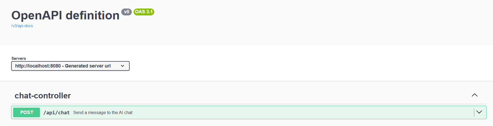
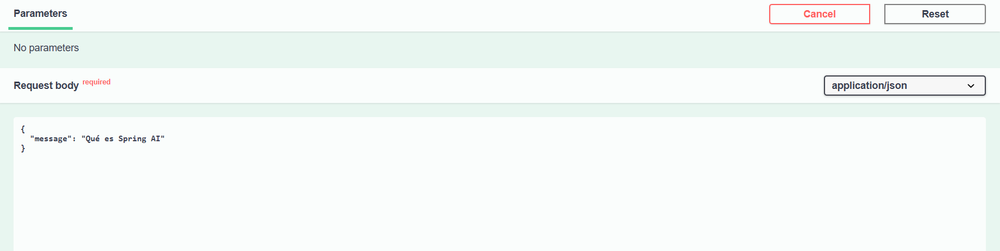
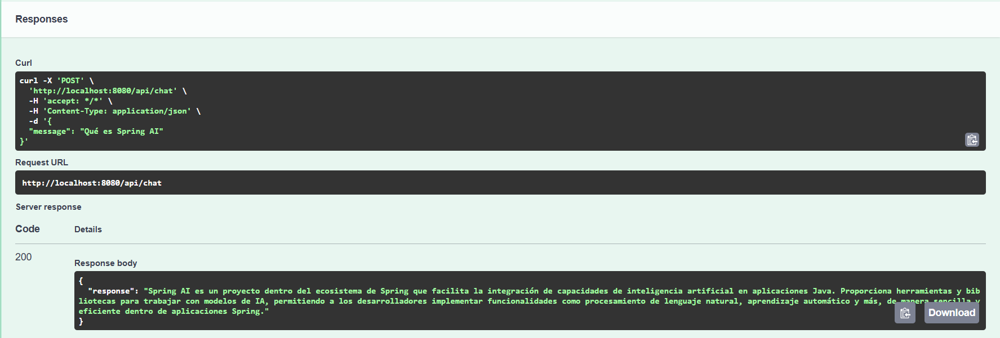

# Lab 01 – AI Chat básico (Spring AI)

Este laboratorio forma parte del repositorio **spring-ai-playground** y tiene como
objetivo familiarizarse con los fundamentos de **Spring AI** a través de un ejemplo
mínimo, controlado y alineado con buenas prácticas de backend.

---

## 🎯 Objetivo

- Entender cómo conectar un LLM usando Spring AI (`ChatClient`)
- Comprender dónde vive el prompting dentro de una arquitectura backend
- Encapsular la IA como una dependencia externa
- Aplicar buenas prácticas de seguridad, diseño y configuración

---

## 📖 Descripción

El laboratorio implementa un **chat AI básico** expuesto mediante un endpoint REST.

El backend actúa como **intermediario entre el cliente y el modelo de lenguaje**,
sin delegar decisiones de negocio ni confiar en la IA como fuente de verdad.

La integración sigue la **documentación oficial de Spring AI** y utiliza un modelo
ligero para mantener el consumo de tokens bajo control.

---

## 🏗️ Arquitectura

El proyecto sigue una separación clara de responsabilidades:

- **API**: Controllers y DTOs (capa HTTP)
- **Application**: Orquestación de la interacción con el LLM
- **Domain**: Conceptos básicos del dominio (mensaje del usuario)
- **Infrastructure**: Integración con el modelo de lenguaje mediante Spring AI

Este enfoque facilita la evolución del sistema sin acoplar la lógica de negocio
a la tecnología de IA.

---

## ✍️ Prompting

En este laboratorio el prompting es **intencionadamente mínimo** y se limita al
mensaje proporcionado por el usuario.

El objetivo es entender **el punto de integración con el LLM** antes de introducir:
- reglas
- contexto adicional
- instrucciones de sistema

---

## 🚫 Qué NO incluye este lab

Este laboratorio **no cubre**:

- Memoria de conversación
- RAG (Retrieval Augmented Generation)
- Tools o ejecución de acciones
- Structured output

Estas capacidades se explorarán en **laboratorios posteriores**.

---

## ✅ Requisitos

- Java 21
- Spring Boot 3.x
- Spring AI 1.1.x
- API key de OpenAI configurada por entorno

⚠️ **La API key no debe incluirse nunca en el código ni en ficheros de configuración.**

---

## 🔐 Configuración de la API key

El proyecto utiliza Spring AI con OpenAI como proveedor del modelo.
La API key debe configurarse como **variable de entorno**.

Ejemplo usando un fichero `.env` (no versionado):

```bash
SPRING_AI_OPENAI_API_KEY=sk-xxxx
```

Cargar las variables en la sesión actual:
```bash
set -a
source .env
set +a
```

Verificar que la variable está disponible:
```bash
echo $SPRING_AI_OPENAI_API_KEY  
```
Spring AI leerá automáticamente esta variable al iniciar la aplicación.

## Ejecución
```bash
   mvn spring-boot:run
```

Probar el endpoint vía curl:
```bash
curl -X POST http://localhost:8080/api/chat \
  -H "Content-Type: application/json" \
  -d '{
    "message": "Explícame qué es Spring AI en una frase"
  }'
 
```
La respuesta contendrá el texto generado por el modelo.


## API Documentation (Swagger)

El proyecto expone su contrato REST mediante OpenAPI / Swagger, lo que permite
explorar y probar el endpoint sin necesidad de herramientas externas como curl
o Postman.

Una vez levantada la aplicación, la documentación interactiva está disponible en:

http://localhost:8080/swagger-ui.html


### Acceso a Swagger UI

Al acceder a la URL se muestra la lista de endpoints disponibles.  
En este laboratorio se expone un único endpoint de chat:



---

### Probar el endpoint desde Swagger

Swagger permite ejecutar peticiones directamente desde el navegador.

Ejemplo de **request body** esperado por el endpoint `/api/chat`:



---

### Respuesta del servidor

La respuesta contiene el texto generado por el modelo de lenguaje:



---

Desde Swagger es posible:
- Explorar el contrato REST
- Validar el formato de entrada y salida
- Ejecutar peticiones reales contra el backend

El uso de Swagger en este laboratorio refuerza el enfoque **API-first** y permite
validar el comportamiento del sistema como una **caja negra**, alineado con
buenas prácticas de desarrollo backend.

## Documentación adicional

Para una explicación más detallada del diseño, las decisiones tomadas y los
aprendizajes obtenidos, ver:

- docs/01-chat-client.md
